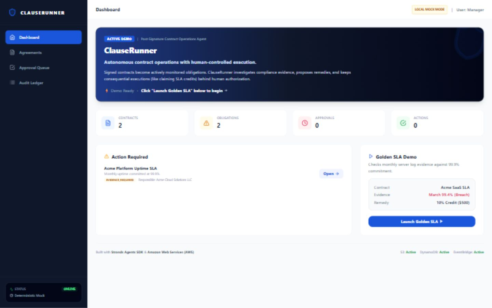
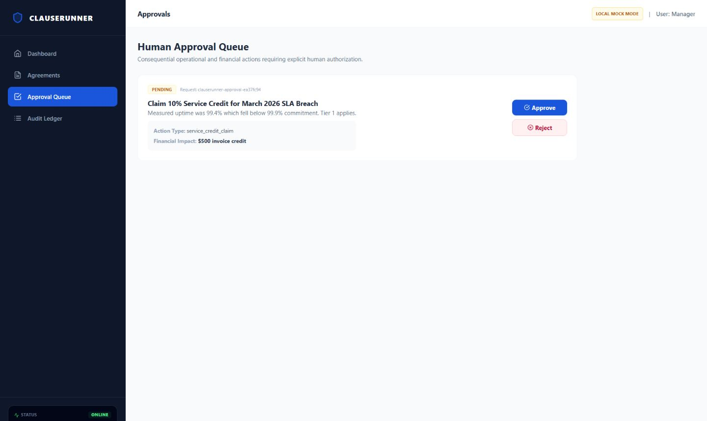
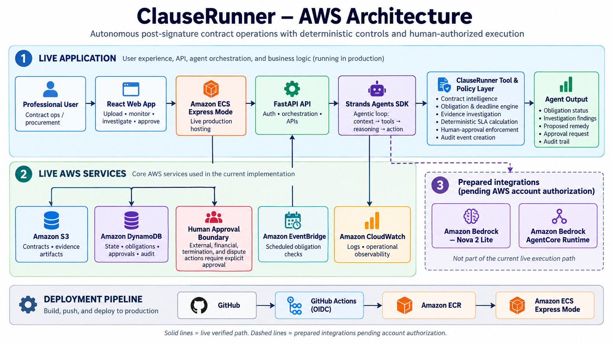

# ClauseRunner — Post-Signature Contract Operations Agent

> Autonomous professional operations agent turning signed vendor agreements into persistent operational obligations, monitoring compliance, and executing remedies under strict human-in-the-loop boundaries.

---

## Why ClauseRunner Exists

Once a contract is signed, it is often archived as a passive PDF. Critical operational obligations—such as monthly service level commitments (SLAs), automatic renewal notice windows, and SOC 2 submissions—are left unmonitored. 

**ClauseRunner turns contracts into active operational code.** It persistently monitors compliance evidence, runs investigations through a Strands Agents SDK implementation, maps violations to remedies, and prepares claim packages under strict deterministic code rules. The current public runtime uses the deterministic fallback while the coded Amazon Bedrock Nova 2 Lite path awaits account authorization.

---

## Main Architecture & Golden Workflow

```
Web Interface (React/Vite) ◄──► FastAPI Backend ◄──► Strands Operations Agent 
                                                       │
                                                       ├─► Deterministic fallback (live)
                                                       ├─► Amazon Bedrock Nova 2 Lite (pending)
                                                       ├─► Storage Layer (SQLite/DynamoDB)
                                                       └─► Audit Trail (Immutability Ledger)
```

### The Golden Workflow (SLA Breach Remedy)
1. **Contract Traceability**: Acme SaaS Agreement is loaded. Uptime SLA obligation (99.9%) is tracked.
2. **Evidence Attached**: An uptime log demonstrating 99.4% availability (breach) is attached.
3. **Agent Investigation**: The Strands Agent retrieves the clause, inspects the log, and invokes the **deterministic engine** to calculate the remedy (Tier 1 applies, $500 Credit).
4. **Human Control Policy**: The agent drafts a service credit claim and submits it to the **Human Approval Queue** (since external claims are consequential).
5. **Human Authorization**: A manager approves the credit claim in the console.
6. **Dispatched Execution**: The operator executes the approved claim, dispatching the credit claim and saving the terminal state with a complete audit history.

---

## Local Setup & Quick Start

Ensure you have Python 3.11+ and Node.js 20+ installed.

### 1. Backend Setup & Run
```powershell
# Create and activate virtual environment
python -m venv .venv
.\.venv\Scripts\activate

# Install requirements
pip install -r requirements.txt --prefer-binary

# Run FastAPI backend (port 8000)
uvicorn backend.main:app --reload
```

### 2. Frontend Setup & Run
```powershell
cd frontend

# Install Node packages
npm install

# Run Vite dev server (port 5173)
npm run dev
```
Open `http://localhost:5173` in your browser.

---

## Environment Configuration (`.env`)

Create a `.env` file in your root workspace. A safe blank `.env.example` is tracked for reference:
```text
AWS_REGION=us-east-1
BEDROCK_MODEL_ID=us.amazon.nova-2-lite-v1:0
CLAUSERUNNER_S3_BUCKET=
CLAUSERUNNER_DYNAMODB_TABLE=
```
*Note: The Amazon Bedrock provider integration targets Amazon Nova 2 Lite (`amazon.nova-2-lite-v1:0` / `us.amazon.nova-2-lite-v1:0`), but live inference remains unverified while account authorization is pending (`NOT_AUTHORIZED`). Amazon Bedrock AgentCore Runtime is also pending and is not part of the current execution path. The public application therefore reports and uses the tested Strands-based **Deterministic Mock Mode** for investigations, state changes, human approvals, and audit events.*

---

## Testing & Verifications

```powershell
# Run the automated backend test suite
python -m pytest backend/tests -v

# Run the frontend production compiler check
cd frontend
npm test
npm run build
```

---

## AWS Services Used
- **Amazon Bedrock**: The Strands provider targets Amazon Nova 2 Lite; live inference is pending active account authorization, so the public runtime uses the deterministic fallback.
- **Amazon S3**: A private, encrypted artifact bucket is provisioned for compliance documents and evidence objects; the current demo fixture references evidence metadata from DynamoDB.
- **Amazon DynamoDB**: Single-table design schema storing authoritative contract states and audit ledgers.
- **Amazon EventBridge**: Enabled scheduled rule and API Destination invoke the obligation checker for expiring notice deadlines.

---

## Security Boundaries & Decoupling
- **Server-Side Decoupling**: All boto3, Bedrock, and secret environment calls are executed on the server. The public React frontend is 100% credential-free.
- **Human Approval Policy in Code**: Financial and notice operations strictly block execution unless a corresponding human authorization is present in our database.

---

## Live Demo

ClauseRunner is live at [https://cl-a7d669f525024e6a8413b2e0f7b851c8.ecs.us-east-1.on.aws/](https://cl-a7d669f525024e6a8413b2e0f7b851c8.ecs.us-east-1.on.aws/).

The production deployment uses:

- **Hosted Public Web Application**: [https://cl-a7d669f525024e6a8413b2e0f7b851c8.ecs.us-east-1.on.aws/](https://cl-a7d669f525024e6a8413b2e0f7b851c8.ecs.us-east-1.on.aws/)
- **Secure Remote Container Builds**: Triggered automatically on push via GitHub Actions with secure OIDC-role authentication (zero local credentials needed!).
- **Amazon ECS Express Mode**: The unified FastAPI + React container runs on Fargate behind managed AWS network infrastructure with strict task-role security.
- **Automated Obligation Checking**: Driven by an EventBridge Connection, API Destination, and Scheduled Rule calling our checking webhook.

---

## Demo Screenshots

### Dashboard



### Human Approval Queue



### AWS Architecture



[View the complete Devpost media gallery](docs/DEVPOST_MEDIA.md).

---

## License

This project is licensed under the **MIT License**—see the [LICENSE](LICENSE) file for details.
