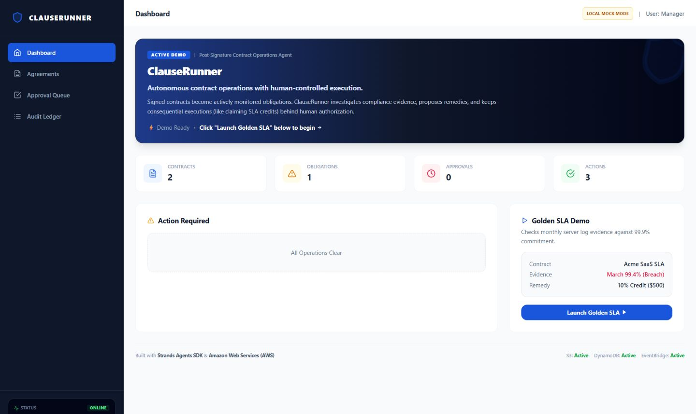
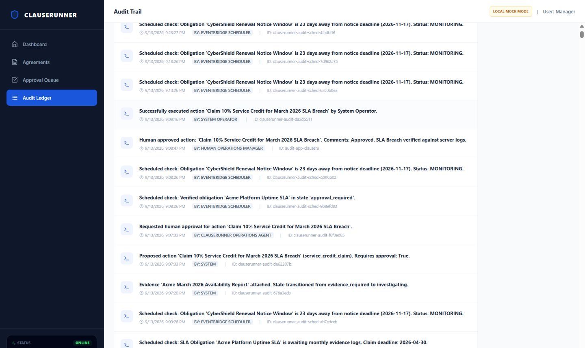

# ClauseRunner Devpost Media

1. **Dashboard**

   Image: [`docs/assets/devpost/01_ClauseRunner_Dashboard.png`](assets/devpost/01_ClauseRunner_Dashboard.png)

   Caption: ClauseRunner — Autonomous Post-Signature Contract Operations

   

2. **Golden SLA Investigation**

   Image: [`docs/assets/devpost/02_Golden_SLA_Investigation.png`](assets/devpost/02_Golden_SLA_Investigation.png)

   Caption: Golden SLA Demo — 99.9% Commitment, 99.4% Breach, $500 Remedy

   

3. **Human Approval Queue**

   Image: [`docs/assets/devpost/03_Human_Approval_Queue.png`](assets/devpost/03_Human_Approval_Queue.png)

   Caption: Human Approval Queue — Consequential Financial Actions Require Authorization

   

4. **Audit Ledger**

   Image: [`docs/assets/devpost/04_Audit_Trail.png`](assets/devpost/04_Audit_Trail.png)

   Caption: Immutable Audit Ledger — Evidence to Investigation to Approval to Execution

   

5. **Architecture**

   Image: [`docs/assets/devpost/05_ClauseRunner_AWS_Architecture.png`](assets/devpost/05_ClauseRunner_AWS_Architecture.png)

   Caption: ClauseRunner — Live AWS Architecture and Strands Agent Workflow

   

Live demo: [https://cl-a7d669f525024e6a8413b2e0f7b851c8.ecs.us-east-1.on.aws/](https://cl-a7d669f525024e6a8413b2e0f7b851c8.ecs.us-east-1.on.aws/)

Source: [https://github.com/GameDevKaran/clauserunner](https://github.com/GameDevKaran/clauserunner)
